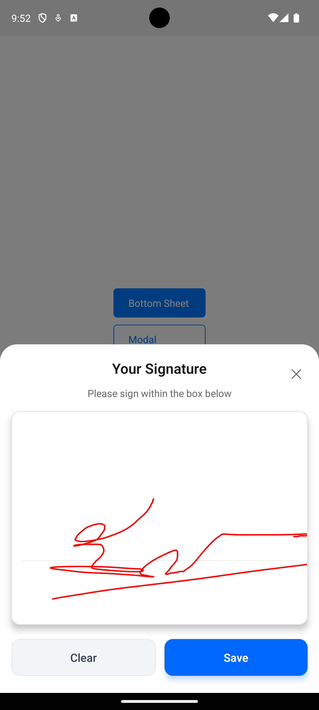
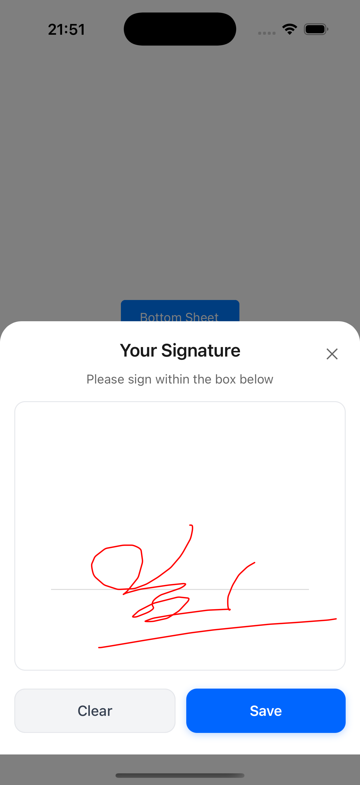

# react-native-phone-signature

> **Note**: This package is currently under development and not ready for production use.

A React Native signature component using native drawing APIs for iOS (UIKit) and Android (Canvas).

## Screenshots

<div style="display: flex; justify-content: center; gap: 20px;">
  <div style="text-align: center;">
    <strong>Android</strong><br/>
    
  </div>
  <div style="text-align: center;">
    <strong>iOS</strong><br/>
    
  </div>
</div>

## Features
- Smooth signature drawing with pressure sensitivity
- Customizable stroke width and color
- Optional baseline guide
- Save signature as PNG/JPEG
- Support both gallery and temporary storage

## Installation

```sh
npm install react-native-phone-signature
```

## Usage

```js
import { SignatureView } from 'react-native-phone-signature';

```

## Contributing

See the [contributing guide](CONTRIBUTING.md) to learn how to contribute to the repository and the development workflow.

## License

MIT

---

Made with [create-react-native-library](https://github.com/callstack/react-native-builder-bob)
